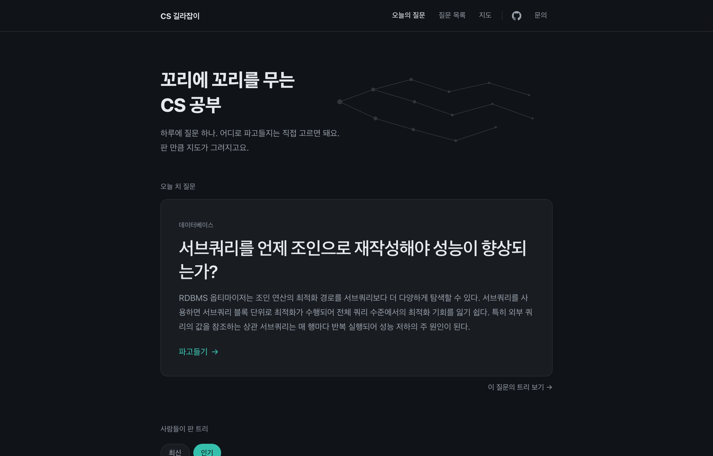
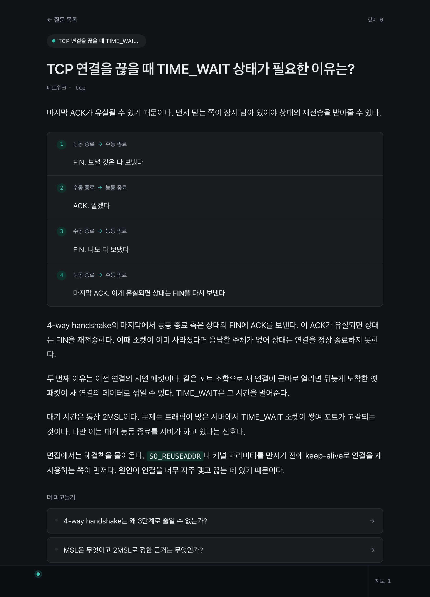
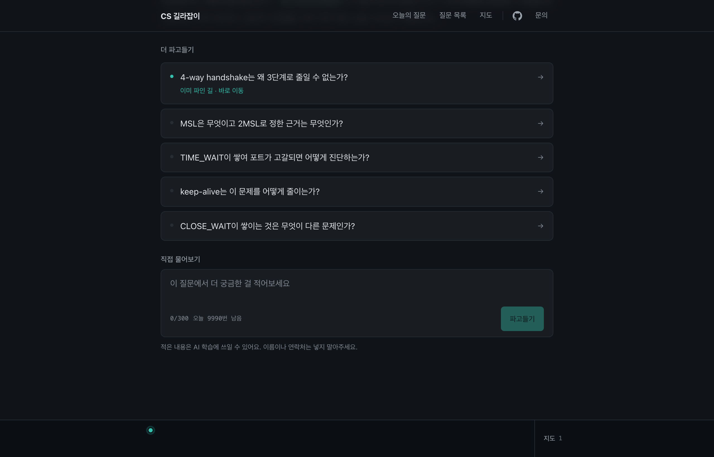
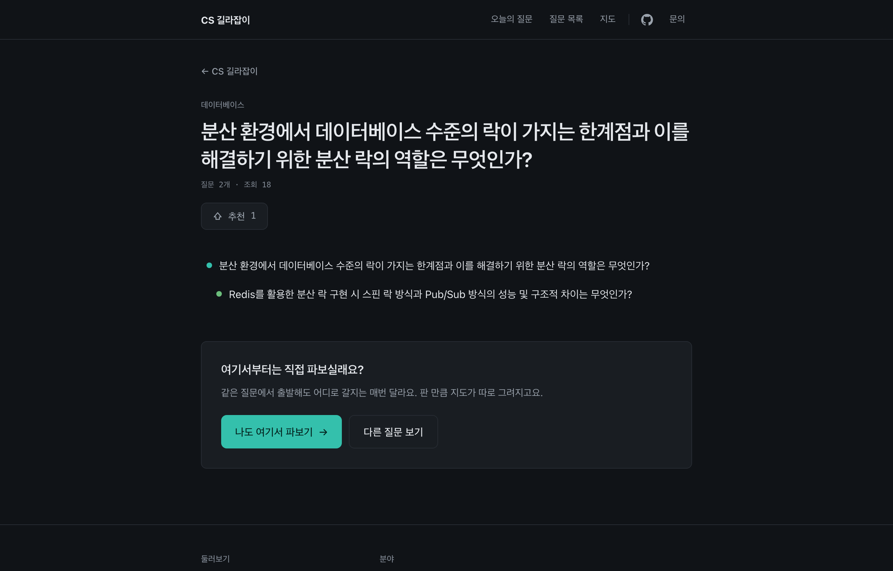
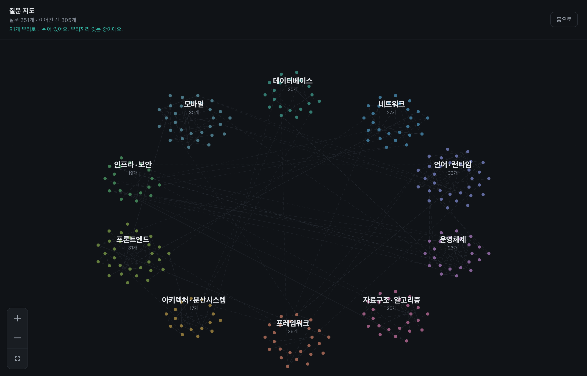
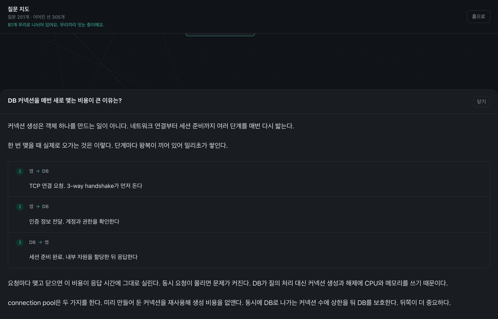
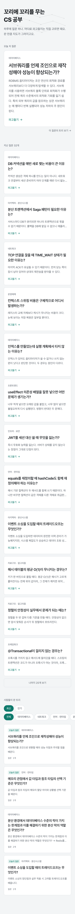

# CS 길라잡이

**하루에 CS 면접 질문 하나. 궁금한 곳으로 계속 파고들면 판 만큼 지도가 남아요.**

<https://cs-pathfinder.vercel.app>

가입 없이 바로 쓰면 돼요. 지금까지 270개 넘는 질문이 쌓였고 매일 늘어요.

---

## 어떤 서비스인가

매일 아침 CS 면접 질문이 하나 올라와요. 읽고 나면 아래에 **꼬리질문 다섯 개**가 붙어 있어요. 궁금한 걸 누르면 그 질문의 해설이 새로 열려요. 거기서 또 다섯 갈래가 생기고요.

읽기만 하는 서비스가 아니라 **파고드는** 서비스예요. 어디로 팔지는 매번 직접 고르면 돼요. 그렇게 판 경로가 그대로 내 지도로 남아요. 링크 하나로 남과 나눌 수 있어요.

---

## 화면 넷

| 화면 | 주소 | 하는 일 |
|---|---|---|
| **오늘의 질문** | `/` | 오늘 올라온 질문이 있어요. 지난 질문과 남들이 판 트리도 여기 있고요 |
| **질문 화면** | `/q/…` | 해설을 읽고 꼬리질문으로 파고드는 곳이에요. 가장 오래 머무는 화면이고요 |
| **질문 목록** | `/questions` | 쌓인 질문을 분야 10개로 나눠 훑어요 |
| **질문 지도** | `/map` | 질문 전부를 별자리처럼 펼쳐 놓고 서로 어떻게 이어지는지 봐요 |

맨 위 헤더에서 언제든 옮겨 다니면 돼요.

---

## 이렇게 써요

### 1. 홈에서 오늘의 질문 열기

가운데 큰 카드가 오늘 질문이에요. `파고들기 →`를 누르면 질문 화면으로 가요. 더 아래로 내리면 지난 질문들과 남들이 판 트리를 모아 둔 게시판이 나와요.

### 2. 해설 읽기

**첫 문장이 곧 답이에요.** 배경 설명부터 시작하지 않아요. 위 화면이라면 `마지막 ACK가 유실될 수 있기 때문이다`가 첫 문장이에요. 그 뒤로 근거가 이어지고요. 바쁘면 첫 문장만 읽고 나가셔도 돼요.

답 바로 뒤에는 **그림**이 와요. 줄글로 읽고 머리로 다시 그리는 수고를 덜어 드리려고요. 내용에 따라 그리는 방식이 달라져요.

| 답이 이런 것이면 | 이렇게 그려요 |
|---|---|
| 무엇 다음에 무엇 (3-way handshake) | 번호 붙은 단계 |
| 어떤 상태에서 어디로 갈 수 있나 (TCP 상태) | 상태마다 갈래를 묶어서 |
| 무엇이 무엇에 속하나 (B-tree, 상속) | 들여쓴 나무 |
| 어디에 놓이고 어느 쪽으로 자라나 (스택과 힙) | 붙어 있는 칸 |
| 둘이 같은 시간에 무엇을 하나 (경쟁 상태) | 시간을 가로로 놓은 표 |
| 위아래로 쌓인 층 (OSI) | 쌓인 칸 |
| 둘을 견주는 것 | 비교표 |

그림은 전부 사이트와 같은 색·같은 글꼴로 그려져요. 바깥에서 받아 온 이미지가 아니라서 확대해도 안 뭉개지고 화면 낭독기도 읽어요.

화면 곳곳에 뭐가 있는지 짚어 드릴게요.

- **왼쪽 위 `← 질문 목록`** — 목록으로 돌아가요
- **그 아래 칩** — 여기까지 어떤 질문을 거쳐 왔는지 보여 줘요. 누르면 그 질문으로 되돌아가고요
- **오른쪽 위 `깊이 0`** — 몇 칸이나 파고 내려왔는지 알려 줘요
- **맨 아래 띠** — 미니맵이에요. 내가 판 질문이 점으로 찍혀요

### 3. 꼬리질문으로 파고들기

해설 아래에 꼬리질문 다섯 개가 있어요. 하나를 누르면 그 질문으로 내려가요. **깊이 제한은 없어요.**

- **`이미 파인 길 · 바로 이동` 배지** — 누군가 이미 판 질문이에요. 새로 만들지 않고 곧바로 그 자리로 가요
- 배지가 없으면 새로 만들어요. 지금은 **20~40초** 걸려요. 그동안 안내 문구가 떠요. 오래 걸리면 문구가 바뀌고요
- **`직접 물어보기`** — 다섯 개 중에 없으면 직접 적으시면 돼요. 하루 몇 번까지 쓸 수 있는지 옆에 숫자로 나와요

> 적으신 내용은 AI 학습에 쓰일 수 있어요. 이름이나 연락처는 넣지 않으시는 편이 좋아요.

### 4. 판 것 확인하기

파고들수록 세 군데에 흔적이 쌓여요.

- **위쪽 경로 칩** — 걸어온 질문들과 `깊이 3` 같은 숫자가 보여요
- **아래쪽 미니맵 띠** — 내가 판 점들이에요. 점에 마우스를 올리면 질문 제목이 나와요
- **색** — 얕은 곳은 서늘한 청록이고 깊어질수록 뜨거워져요. 장식이 아니라 얼마나 팠는지 읽는 표시예요

미니맵 오른쪽 `지도`를 누르면 **내가 판 것만** 전체 화면으로 펼쳐져요. 상자끼리 선으로 이어지고 지금 보고 있는 질문은 초록으로 칠해져요.

> 한 칸도 안 팠을 때는 볼 게 거의 없어요. 서너 칸 파고 나서야 쓸모가 생겨요.

### 5. 링크로 나누기

다 판 경로는 링크가 돼요. 받은 사람은 그 트리를 그대로 봐요.

목록의 각 줄이 링크라 아무 질문이나 눌러 들어갈 수 있어요. 맨 아래 `나도 여기서 파보기`를 누르면 **그 트리의 첫 질문**에서 내 탐험이 시작돼요. 남이 판 끝에서 이어가고 싶으면 목록의 마지막 줄을 직접 누르시면 되고요.

추천은 로그인 없이 눌러요. 브라우저가 기억해요.

---

## 질문 지도 보는 법

**점 하나가 질문 하나, 색이 분야예요.** 열 덩어리로 뭉쳐 있고 가운데에 분야 이름과 개수가 떠 있어요.

| 하고 싶은 것 | 방법 |
|---|---|
| 질문 하나 읽기 | 점을 누르세요 |
| 한 분야만 크게 보기 | 분야 이름을 누르세요 |
| 제목까지 읽기 | 확대해 보세요. 배율이 올라갈수록 점이 제목으로 바뀌어요 |
| 전체로 돌아오기 | 왼쪽 아래 `⛶`(전체 보기)를 누르세요 |
| 나가기 | 오른쪽 위 `홈으로`를 누르세요 |

점을 누르면 아래에서 서랍이 올라와요. 해설 전문이 그대로 들어 있어요. 다른 화면으로 넘어가지 않고 읽으시면 돼요.

서랍 아래쪽에는 **이어진 질문**이 있어요. 왜 이어졌는지도 한 문장으로 붙고요.

> **JOIN 연산의 성능을 결정하는 핵심 요소는 무엇인가?**
> 이어진 질문 1개 — 조인으로 인해 성능 저하가 발생하는 원인은 무엇인가?
> *두 질문 모두 JOIN 연산 시 발생하는 성능 저하의 원인과 결정 요소를 다루고 있다.*

선은 두 종류예요. **진한 선은 누군가 실제로 걸어간 길**이고 **옅은 점선은 뜻이 비슷해서 이어준 관계**예요. 뒤쪽은 판정이 이은 쪽이라 가끔 틀려요. 그래서 다르게 그렸어요.

> 지도가 두 개예요. 헤더의 `지도`는 서비스 전체, 질문 화면 아래쪽의 `지도`는 내가 판 것만이에요.

---

## 자주 묻는 것

**가입해야 하나요?**
아니요. 그냥 들어와서 쓰시면 돼요.

**판 경로는 어디에 남나요?**
쓰시는 브라우저에 남아요. 서버에 계정이 없어서 **기기를 바꾸면 사라져요.** 남기고 싶으면 링크로 공유해 두시면 돼요.

**질문은 누가 만드나요?**
AI가 만들어요. 오늘의 질문은 매일 아침 6시에 하나 올라와요. 꼬리질문은 누를 때마다 만들어지고요. 사람이 손으로 쓴 질문 30개가 기준선으로 함께 들어 있어요.

**같은 질문을 두 사람이 파면 두 개가 되나요?**
아니요. 같은 걸 묻는 질문이면 이미 있는 자리로 보내요. 그래서 `이미 파인 길` 배지가 떠요.

**꼬리질문이 안 만들어져요.**
무료 AI 한도에 걸리면 느려지거나 실패해요. 잠시 뒤 다시 누르면 대개 돼요.

**해설이 이상해요.**
AI가 쓴 글이라 가끔 틀려요. 헤더의 `문의`를 누르면 GitHub 이슈와 메일 주소가 나와요. 어느 쪽이든 좋아요.

---

## 모바일

폰을 기준으로 만들었어요. 미니맵은 접히지 않고 화면 아래에 늘 붙어 있어요.

비교표는 좁은 화면에서 줄 단위 카드로 접혀요. 세 칸짜리 표를 그대로 밀어 넣으면 어느 칸이든 잘리거든요.

 

---

어떻게 만들었는지가 궁금하시면 [`code/docs/engineering.md`](code/docs/engineering.md)에 적어 뒀어요. 지금까지 올라온 질문 전문은 [`cs/questions.md`](cs/questions.md)에 있고요.

MIT 라이선스예요.
