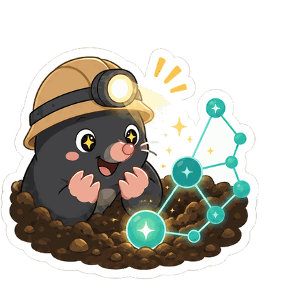
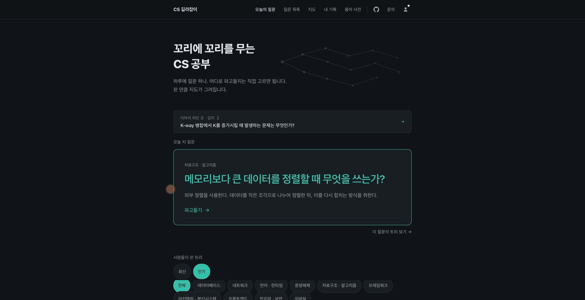
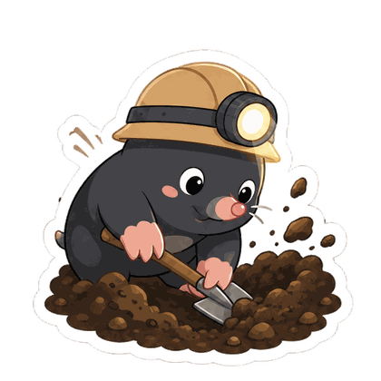

<div align="center">



# 꼬리에 꼬리를 무는 CS 공부

**질문에 답하고, 부족한 개념을 따라가면 나만의 CS 학습 지도가 됩니다.**

<p>
  
  
  
  
</p>

**[지금 바로 써 보기 → cs-pathfinder.vercel.app](https://cs-pathfinder.vercel.app)**

<br />



<sub>오늘의 질문을 열고 → 꼬리질문을 눌러 → 다음 해설로. 경로가 위에 쌓입니다.</sub>

</div>

<br />

취준생과 주니어 개발자가 CS 면접을 준비하는 학습 지도입니다. 질문을 읽는 데서 끝나지 않습니다. 먼저 직접 답하고 모범답안과 비교합니다. 부족한 개념은 꼬리질문 다섯 개와 관련 질문을 따라 공부합니다. 그렇게 이어 간 경로와 다시 볼 답이 나의 학습 기록이 됩니다.

| ✍️ 답변 연습 | ⛏️ 꼬리질문 5개 | 🗺️ 질문 지도 |
| :---: | :---: | :---: |
| 질문마다 내 답을 적고<br />모범답안과 비교합니다 | 기존 질문은 바로 열고<br />없으면 그 자리에서 만듭니다 | 335개 질문과<br />내가 이어 간 경로를 봅니다 |

- 질문 읽기·답변 연습·지도는 **가입 없이** 씁니다. 질문 **335개**, 매일 아침 6시에 하나씩 늘어납니다
- 해설 전문은 [`cs/explanations/`](cs/explanations/)에 마크다운으로도 있습니다 — 코드를 안 열어도 읽을 수 있습니다
- 정확도는 짐작 대신 **측정**합니다 — 아래 "얼마나 믿어도 되는가"에 숫자 그대로 적었습니다

---

## 📖 읽는 화면

질문마다 `내 답변 적어보기`와 `모범답안 확인하기`가 접혀 있습니다. 먼저 답한 뒤 모범답안을 열어 비교할 수 있습니다. 초안과 `다시 볼래요` 표시는 현재 브라우저에만 저장됩니다.

모범답안의 첫 문장이 결론입니다. 순서, 상태 갈래, 계층, 메모리 배치, 시간 축, 비교표는 내용에 필요할 때만 붙습니다. 전부 React 요소라 확대해도 뭉개지지 않고 화면 낭독기도 읽습니다.

글에 따라 한 구절에 형광펜이 그어져 있거나 `핵심 정리`·`주의` 상자가 끼어 있습니다. 다 세게 칠하면 어느 것도 안 띄므로 아껴 씁니다. 본문의 점선 깔린 용어(`스레드`, `TLB` 같은 것)를 누르면 한 줄 뜻과 그 개념을 묻는 면접 질문으로 이어집니다. 전체 낱말은 [용어 사전](https://cs-pathfinder.vercel.app/glossary)에서 훑을 수 있습니다.

## ⛏️ 파고들기


꼬리질문에 `이미 만든 질문 · 바로 이동` 표시가 있으면 기다리지 않고 읽습니다. 없으면 그 자리에서 새 질문을 만듭니다. 만드는 동안에는 진행 상태가 화면에 계속 보입니다. 다섯 개 중 마음에 드는 게 없으면 직접 적어도 됩니다.

아래 `관련 질문`은 이미 있는 글로 옮기는 링크입니다. 새 질문을 만드는 추천 꼬리질문과 달리 기다릴 필요가 없습니다.

## 🗺️ 질문 지도


질문 전부를 별자리처럼 펼쳐 놓았습니다. 점 하나가 질문 하나, 색이 분야입니다. 선이 두 종류인데 — **진한 선은 누군가 실제로 걸어간 길**, 옅은 점선은 뜻이 비슷해서 이어 준 관계입니다. 뒤쪽은 판정이 이은 것이라 가끔 틀리고, 그래서 다르게 그렸습니다.

## ✨ 그 밖에

- **링크로 나누기** — 다 파고든 경로는 링크가 됩니다. 받은 사람은 트리를 그대로 보고, `나도 여기서 파보기`로 자기 탐험을 시작합니다
- **학습 기록** — 열어 본 질문과 직접 답해 본 질문을 나눠 봅니다. 다시 볼 답을 앞에 모으고 방문 기록은 잔디 이미지로 공유할 수 있습니다
- **키워드에서 질문 찾기** — 용어 사전의 한글·영문 별칭에서 관련 면접 질문 5개와 선행·연관 개념으로 이어집니다
- **레쥬메 맞춤 질문** — 기술 경험에서 선택 이유와 트레이드오프를 묻는 질문 5개를 만듭니다. 레쥬메 원문은 저장하지 않습니다
- **로그인은 선택** — 안 해도 전부 씁니다. 로그인하면 파고든 경로와 잔디가 계정에 모여 기기 간에 합쳐집니다. **받는 것은 이메일 하나뿐** — 이름도 프로필 사진도 구글이 줘도 버립니다. `계정 삭제`를 누르면 서버 기록이 함께 지워집니다
- **질문 목록** — 분야 10개로 훑고 태그 18개로 거릅니다. 분야는 소속, 태그는 주제라 축이 다릅니다
- **RSS와 카카오톡** — `https://cs-pathfinder.vercel.app/rss.xml`을 구독하거나, 카카오톡에서 **CS 길라잡이** 채널을 친구 추가하면 봇에게 바로 물어볼 수 있습니다 — "오늘의 질문"이라고 보내면 오늘 것을 주고, 아무 CS 궁금증을 보내면 비슷한 질문의 해설을 찾아 줍니다

## 🔍 얼마나 믿어도 되는가

**해설 초안은 AI가 씁니다.** 그래서 정확도를 짐작으로 말하지 않고 잽니다.

표본을 떠서 다른 모델(OpenAI Codex)에 엄격한 잣대로 대조시켰더니 **AI가 쓴 20편 중 15편, 사람이 쓴 11편 중 7편**에서 사실 오류가 나왔습니다. 대부분 완전한 헛소리가 아니라 **조건을 뺀 단정**이었습니다 — "항상", "반드시"가 실제로는 조건부인 문장들. 면접에서 그대로 말하면 되묻히는 종류입니다.

그래서 전편을 같은 잣대로 재검했습니다. 모델이 쓴 245편을 4회에 걸쳐 훑어 **오류 59건을 고쳤습니다.** 회차마다 오류율이 7%에서 43%까지 갈렸고, 고친 사람이 다음 오류를 만드는 것도 세 번 확인했습니다. 그래서 한 번 훑은 것으로 끝내지 않습니다.

335편 중 90편은 사람이 손으로 썼습니다. 30편은 AI가 따라 쓸 기준선이고, 60편은 AI가 잘 다루지 못하던 분야(컨테이너·합의 알고리즘 등)를 메우려고 따로 쓴 것입니다.

잰 방법과 기록은 [`code/docs/audit/`](code/docs/audit/)에 있습니다. **틀린 것을 찾으면 이슈로 알려 주세요.** 이 저장소가 가장 반기는 기여입니다.

## 🚀 직접 돌려보기

```bash
cd code
npm install
npm run dev     # http://localhost:3000
```

**Docker도 API 키도 필요 없습니다.** `DATABASE_URL`이 없으면 인메모리 Postgres(PGlite)로 돌고, AI 키가 없으면 결정론적 스텁이 대신 답합니다. 부팅할 때 질문 335개와 관계 397개가 자동으로 들어갑니다.

```bash
npm test        # 1600개 이상
npm run typecheck
```

## 🏗️ 구조

```
cs/       질문 전문 마크다운. 코드를 안 열어도 무엇이 담겼는지 보입니다
code/     앱 전부 — src·data·scripts·tests·설정
```

Next.js 16(App Router) · React 19 · Tailwind v4 · TypeScript · Postgres(Neon)/PGlite · AI SDK v6 + Gemini · better-auth · Vercel.

설계의 축은 **노드는 개념이고 경로는 개인의 것**이라는 구분입니다. 같은 질문은 하나만 존재하고 여러 갈래에서 도달하지만, 내가 걸어온 길은 나만의 것으로 따로 남습니다. 왜 그렇게 했고 무엇을 재서 정했는지는 [`code/docs/engineering.md`](code/docs/engineering.md)에 있습니다.

## 🤝 기여

가장 반기는 것은 **틀린 해설을 찾아 주는 일**입니다. 이슈 하나로 충분하고, 직접 고치는 방법은 [`CONTRIBUTING.md`](CONTRIBUTING.md)에 있습니다. 오타 고치기, 용어 사전에 한 줄 더하기처럼 작고 끝이 분명한 것부터 적어 두었습니다.

## 📄 라이선스

MIT입니다. 해설이든 코드든 자유롭게 가져다 쓰고, 출처 링크를 남겨 주면 고맙습니다. 다만 해설에는 오류가 있을 수 있습니다 — 얼마나 있는지는 위에 재 둔 그대로입니다.

<div align="center">
<br />



<sub>**오늘도 한 삽.** 내일 아침 6시에 새 질문이 올라옵니다.</sub>

</div>
