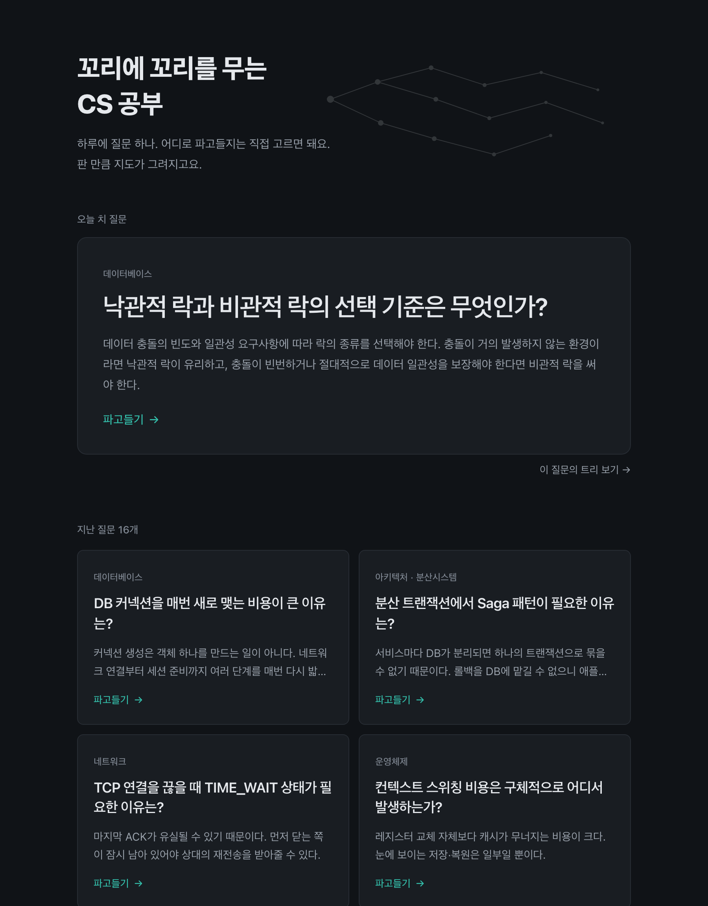
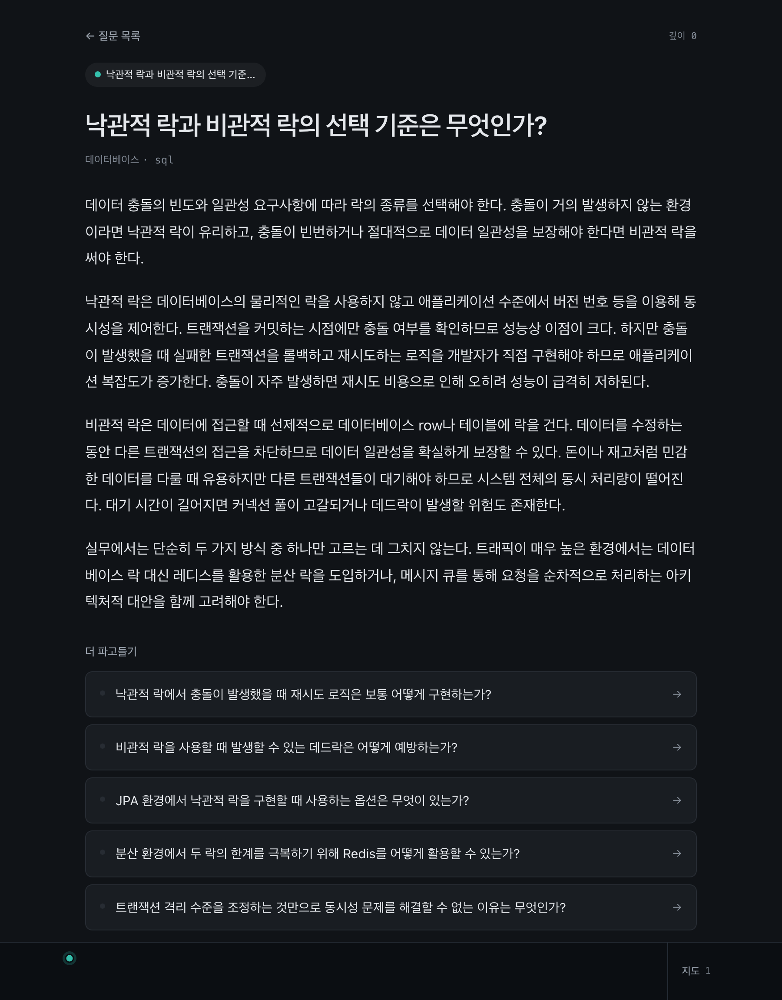
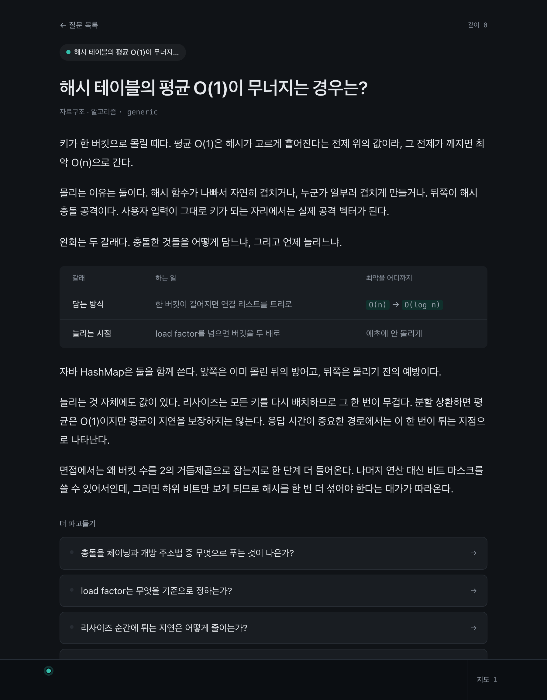
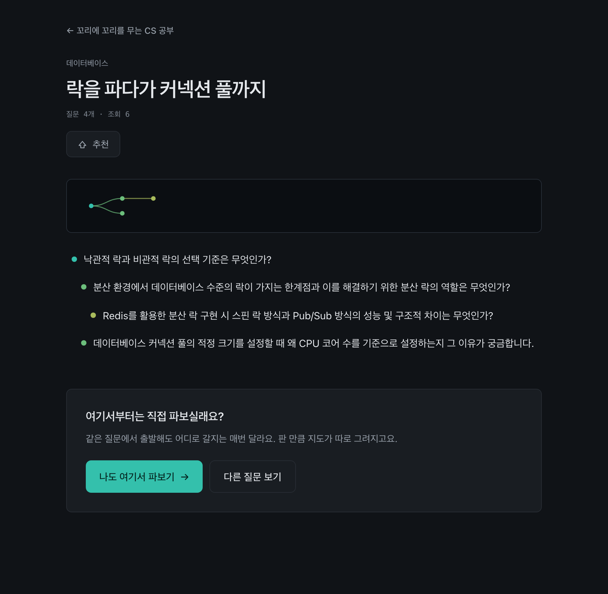

# cs-pathfinder

**꼬리에 꼬리를 무는 CS 공부.** 하루에 질문 하나를 받고, 궁금한 곳으로 계속 파고들면 판 만큼 지도가 남는다.

<https://cs-pathfinder.vercel.app>

카톡방에 올라오는 CS 면접 질문이 선형 텍스트라 꼬리질문끼리 어떻게 이어지는지가 안 보인다는 데서 출발했다. 질문을 **그래프로 저장하고 사용자가 판 경로만 트리로** 보여준다.



## 어떻게 도는가

질문을 누르면 해설과 꼬리질문 5개가 나온다. 그중 하나를 고르거나 직접 입력하면 거기서 또 다섯 갈래가 열린다. 깊이 제한은 없다.



**순서·계층·비교는 줄글로 두지 않는다.** 3-way handshake를 문장으로 읽으면 독자가 머리로 다시 그려야 한다. 해설 안에서 도식 세 가지를 쓴다 — 주고받는 차례는 `:::flow`, 쌓인 구조는 `:::stack`, 같은 잣대로 견주는 것은 표다.



Mermaid를 쓰지 않았다. SVG 문자열을 `innerHTML`로 넣어야 하는데 자유 입력이 전역 자산이 되는 구조라 그 경로를 아예 두지 않는 편이 낫고, 2.8MB짜리 의존성이 붙고, 생김새가 이 디자인과 겉돈다. 전부 React 요소로 그린다.

파서의 첫째 성질은 **본문을 절대 먹지 않는 것**이다. 모델이 문법을 조금 틀렸다고 해설이 빈 화면이 되면 도식으로 얻은 것보다 잃는 것이 크다. 못 알아본 것은 문단으로 떨어지고, 어떤 이유로든 남은 울타리 기호는 화면에 닿기 전에 털어낸다.

색이 곧 깊이다. 얕은 곳은 서늘한 청록이고 파고들수록 뜨거워진다. 장식이 아니라 경로 칩과 미니맵에서 "얼마나 팠는지"를 읽는 정보다.

판 경로는 지도로 볼 수 있다. 지금 서 있는 자리를 가운데 놓고 어디서 왔는지와 어디로 갈 수 있는지를 함께 보여준다. 폰에서는 전체를 넣으려 하면 글자가 뭉개지므로 읽을 수 있는 배율을 지키고 나머지는 밀어서 본다.

다 판 경로는 링크 하나로 공유한다. 링크를 받은 사람은 그 트리를 그대로 보고, 같은 자리에서 자기 탐험을 시작할 수 있다.




### 모바일이 기준이다

유입이 카톡 링크라 첫 방문은 대부분 폰이다. 미니맵은 접히지 않고 상시 노출된다. 포커스 뷰만 있으면 결국 선형이라, 카톡과 구조적으로 같은 계열이 되어버린다.

<br clear="right" />

## 설계에서 중요한 것

**노드는 개념이고 경로는 개인의 것이다.** `qnode`의 유일키는 (의미 범위 + 질문 문장) 해시이고 부모와 무관하다. "TCP 3-way handshake란?"은 하나만 존재하고 DB 경로와 네트워크 경로 양쪽에서 도달한다. 부모-자식 관계는 `qedge`에 따로 있다.

**전역 그래프는 DAG가 아니다.** 순환을 허용한다. 지식 관계에서는 `TCP → 3-way handshake`와 그 역이 둘 다 성립한다. 조상 중복은 경로를 만들 때만 막는다.

**경로는 노드 참조가 아니라 발자국(occurrence)으로 저장한다.** 전역 간선이 `A→C`와 `B→C`일 때 방문 집합 `{A,B,C}`에서 부분그래프를 유도하면 가본 적 없는 `B→C`가 화면에 그려진다. 부모를 명시적으로 들고 있어야 그때 그 경로가 유일하게 복원된다.

**같은 질문을 다시 물으면 새로 만들지 않는다.** 여기가 비용의 급소다.

처음에는 LLM이 자유 입력을 표준 문장으로 다듬고 그 해시를 캐시 키로 쓰려 했다. **실호출에서 반증됐다.** 같은 뜻의 세 표현이 세 개의 문장이 됐고, 바이트 단위 재현이 전제였던 비용 모델이 무너졌다. 원인은 프롬프트가 아니라 방식이었다 — LLM의 자유 생성은 결정론이 아니다.

지금은 **생성이 아니라 선택**이다. 이미 있는 형제·조부모 노드를 후보로 주고 "같은 것을 묻는 게 있으면 골라라"고 시킨다. 출력이 문장이 아니라 id라 재현성이 훨씬 높고, 모델을 바꿔도 계약이 안 깨진다.

**잘못 나눈 노드는 나중에 합칠 수 있지만 잘못 합친 노드는 복구되지 않는다.** 그래서 게이트는 애매하면 고르지 않는다. 정확도 기준도 비대칭으로 잡았다 — precision은 100%, recall은 90%면 된다.

## 정확도 측정

게이트가 제대로 고르는지는 짐작이 아니라 실측으로 본다. 실제 `runGate`를 부르고, 함정(고르면 안 되는 것)을 세트의 4분의 1 넣는다. 매칭 케이스만 넣으면 "전부 고르는" 게이트가 만점을 받는데, 그게 최악의 게이트다.

```bash
npm run measure:match -- --runs 4              # 튜닝 세트
npm run measure:match -- --set heldout --runs 3  # 홀드아웃
```

| 지표 | 뜻 | 목표 |
|---|---|---|
| precision | 고른 것 중 맞은 비율 | 100% — 잘못 합치면 되돌릴 수 없다 |
| recall | 골랐어야 할 것 중 고른 비율 | 90% — 놓치면 노드가 하나 더 생길 뿐이다 |
| 잘못 거절 | 멀쩡한 질문을 문전에서 막은 수 | 0 — 사용자가 겪는 실패 중 가장 나쁘다 |
| 어투 위반 | 새로 만든 문장이 경어체로 끝난 수 | 0 — 한 트리 안에서 말투가 갈리면 안 된다 |

뒤의 두 줄은 나중에 붙였다. precision은 매칭한 것만, recall은 매칭했어야 할 것만 본다. 멀쩡한 CS 질문을 거절하는 실패도, 판정은 맞았는데 문장이 "~인가요?"로 나오는 실패도 두 분모 어디에도 없다. 지표가 없는 동안 둘 다 실제로 일어나고 있었다.

**세트가 둘인 이유.** 프롬프트를 이 세트를 보면서 세 번 고쳤다(v2 → v3 → v4). 그 뒤의 만점은 일반화가 아니라 그 세트에 맞춰진 결과일 수 있다. 그래서 튜닝에 한 번도 쓰지 않은 세트를 따로 뒀다. 도메인도 겹치지 않게 골랐다.

| 세트 | 케이스 | 반복 | precision | recall | 잘못 거절 | 회차 간 흔들림 |
|---|---|---|---|---|---|---|
| 튜닝 | 46 | 4 | 124/124 | 124/124 | 0/172 | 0/46 |
| 홀드아웃 | 30 | 3 | 60/60 | 60/60 | 0/84 | 0/30 |

**"완벽하다"고 읽으면 안 된다.** 게이트 호출 274건에서 오류가 0건이라는 뜻이고, 표본이 그만큼이면 실제 오류율의 신뢰상한은 1% 안팎이다. 두 세트 모두 같은 사람이 같은 방식으로 만들었다는 한계도 그대로 있다. 프롬프트를 고칠 일이 생기면 튜닝 세트에서 고치고 홀드아웃은 결과만 읽는다 — 홀드아웃을 보고 고치는 순간 홀드아웃이 아니게 된다.

## 도식이 실제로 붙는지

프롬프트만 고치고 넘어가면 모델이 따르는지 알 수 없다. 실호출로 잰다.

```bash
npm run measure:diagrams 2
```

| 지표 | 결과 |
|---|---|
| 도식이 붙은 해설 | 4/6 |
| 기호가 샌 해설 | 0/6 |
| 첫 도식이 답 바로 뒤 | 4/4 |
| 150자 넘는 문단 | 0/22 |

도식이 없는 건은 정상이다. 넣을 것이 없으면 넣지 말라고 프롬프트에 적었고, 억지로 만든 도식은 없는 것보다 나쁘다.

기호가 새는 쪽은 0이어야 한다. 도식을 못 그리는 것은 아쉬운 정도지만 `:::`가 화면에 보이는 것은 고장으로 읽힌다. 첫 측정에서 실제로 샜고, 원인은 모델이 매번 조금씩 다르게 쓰는 것이었다 — `::: flow`로 띄우거나, 여는 줄 뒤에 설명을 붙이거나, `:::end`로 닫는다. 문장 끝에 울타리를 붙여 쓰는 모양(`…나뉜다. :::stack`)도 있어서 파서가 그 줄을 쪼개 살린다.

뒤의 두 지표는 나중에 붙였다. 도식이 붙어도 줄글 세 문단 뒤에 있으면 거기까지 가기 전에 읽기를 그만두고, 문단이 200자면 폰에서 여덟 줄이라 그 자체가 벽이다. 실제로 운영에 올라간 해설의 문단이 190~210자였다. 손으로 쓴 예시가 중앙 103자에 최대 150자라 그 선을 규칙으로 삼았다.

**손으로 쓴 예시는 프롬프트에 안 들어간다.** `data/example-nodes.ts`는 DB 시드 전용이고, 프롬프트는 자체 도식 조각만 들고 있다. 그래서 위 숫자는 규칙만으로 나온 결과다.

그래도 예시를 같은 규칙에 맞췄다. 사용자가 실제로 읽는 콘텐츠라 생성분과 모양이 다르면 사이트가 두 사람이 쓴 것처럼 읽힌다. 30개 전부에 대해 문단 150자와 도식 위치를 시험으로 묶어두었다.

## 동시성 검증

테스트는 PGlite로 돈다. Postgres를 WASM으로 컴파일한 것이라 의미론은 같지만 **연결이 하나뿐이라 진짜 경합이 재현되지 않는다.** 행 잠금과 `on conflict` 경합은 순차 정합성만 증명된다.

그래서 실제 Postgres에 동시 요청을 던지는 검사를 따로 둔다.

```bash
npm run verify:concurrency
```

| 검사 | 무엇이 어긋나면 문제인가 | 결과 |
|---|---|---|
| 할당량 예약 | 한도 5에 20건이 몰릴 때 5건만 통과해야 한다 | 5/20 승인 |
| 추천 카운터 | 20명이 동시에 눌러도 카운터가 20이어야 한다 | 카운터 20 · 표 행 20 |
| 같은 사람 연타 | 카운터와 표 행이 어긋나면 사용자가 자기 표를 잃는다 | 일치 |
| 생성 리스 | 하나만 생성해야 한다. 여럿이면 그만큼 LLM을 태운다 | acquired 1 / busy 11 |
| 하루 하나 보장 | 같은 날짜에 트리가 둘 생기면 홈이 주인공을 못 고른다 | 트리 1개 |
| 시드 소비 | 밀린 시도가 시드를 되돌려야 400개가 안 녹는다 | 1개 소비 |

프로덕션 DB에 쓰기 때문에 흔적은 만든 자리에서 전부 지운다. 발행 검사는 2099년 날짜를 써서 실제 발행일과 겹칠 수 없게 했다.

## 실행

```bash
npm install
npm run dev          # http://localhost:3000
npm test             # 521 tests
npx tsc --noEmit
```

**Docker가 필요 없다.** `DATABASE_URL`이 없으면 PGlite(WASM Postgres)로 인메모리에서 돈다. plpgsql까지 그대로 돌아서 실제 의미론으로 테스트할 수 있다. 있으면 그 Postgres를 쓴다.

`GOOGLE_GENERATIVE_AI_API_KEY`가 없으면 결정론적 스텁이 대신 답한다. 해설 첫 문단에 개발용임이 박혀 있어 진짜와 헷갈리지 않는다. 키가 있으면 스텁은 아예 로드되지 않는다.

부팅 시 예시 루트 30개가 자동으로 시드된다. 노드 ID는 질문 텍스트에서 파생하므로 서버를 다시 띄워도 같은 URL이 살아 있다.

### 운영 명령

| 명령 | 하는 일 |
|---|---|
| `npm run db:migrate` | 실제 Postgres에 스키마 적용 (이력을 남겨 두 번 돌려도 안전) |
| `npm run seed` | 주제어 412개와 예시 루트 30개 삽입 |
| `npm run publish:daily [날짜]` | 오늘의 질문 수동 발행 |
| `npm run db:republish -- [날짜]` | 잘못 뽑힌 발행분을 버리고 다시 뽑기 |
| `npm run db:purge-stubs` | 키 없는 배포가 남긴 가짜 해설 정리 |
| `npm run db:status` | 발행 이력과 남은 시드 일수 |
| `npm run db:backfill-links` | 이미 판 꼬리질문을 결과 노드와 잇기 |
| `npm run verify:concurrency` | 실제 Postgres에 동시 요청을 던져 잠금이 도는지 확인 |

## 무료 티어로 돈다

Gemini 무료 티어 안에서 굴러가게 짰다.

**모델을 일마다 다르게 쓴다.** 매칭 게이트는 매 요청마다 도니 가장 싼 것을, 해설 생성은 사용자가 실제로 읽는 글이라 한 단계 위를, 오늘의 질문은 하루 한 번이고 서비스의 얼굴이라 품질을 앞에 둔다.

**키와 모델 양쪽으로 폴백한다.** 한도·인증·일시 오류·치명 오류를 갈라서, 한도면 다음 모델로 내려가고 일시 오류면 같은 조합을 한 번 더 친다. 사슬의 끝은 Gemma다.

비용 모델은 **캐시가 하나도 안 맞는다고 치고** 짰다. 캐시는 하되 적중률을 비용 계산의 전제로 삼지 않는다. 적중률을 모르는 채로 안전한 쪽이다.

## 알려진 한계

- **해설 스트리밍이 없다.** `POST /api/expand`가 JSON 통짜 응답이라 대기가 그대로 대기다. 지금은 진행 표시로 대체한다
- **인증이 없다.** 경로는 브라우저 `localStorage`에만 있어서 기기를 옮기면 사라진다. 추천도 쿠키로만 식별한다
- **익명 하루 한도를 임시로 9999회까지 열어 뒀다.** 기본값은 5회이고 `QUOTA_ANON_DAILY`로 바꾼다. 5회로 되돌리면 그래프가 작을수록 새 생성이 많아, 서비스가 가장 비어 있을 때 사용자가 가장 빨리 막힌다
- 주제어 시드 412개 = 13개월치

## 기술

Next.js 16 (App Router) · React 19 · Tailwind v4 · TypeScript · Postgres(Neon) / PGlite · AI SDK v6 + Gemini · Vercel

## 라이선스

MIT
